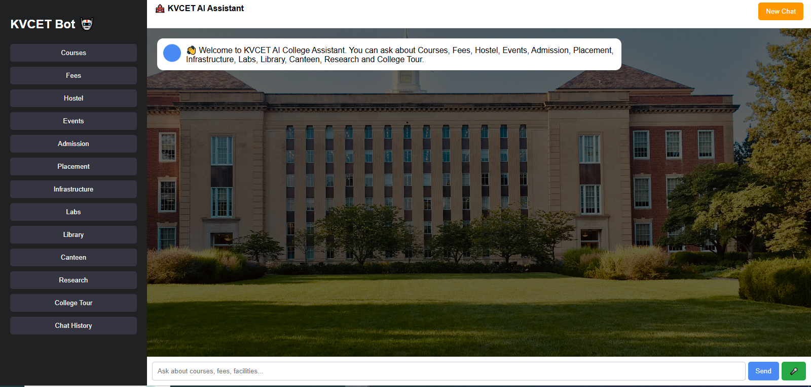
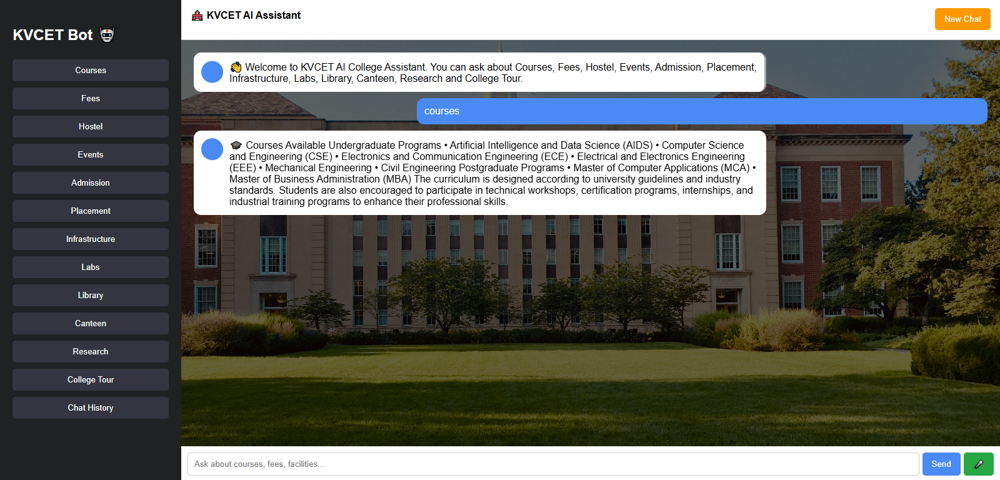
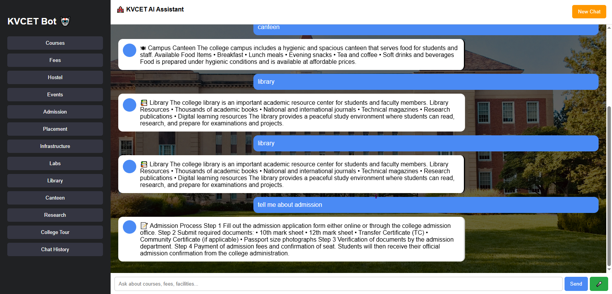
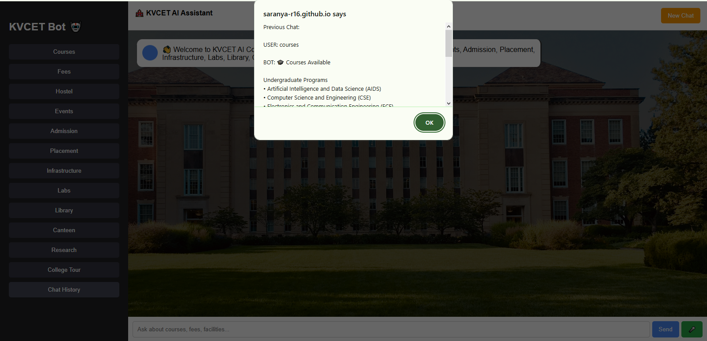
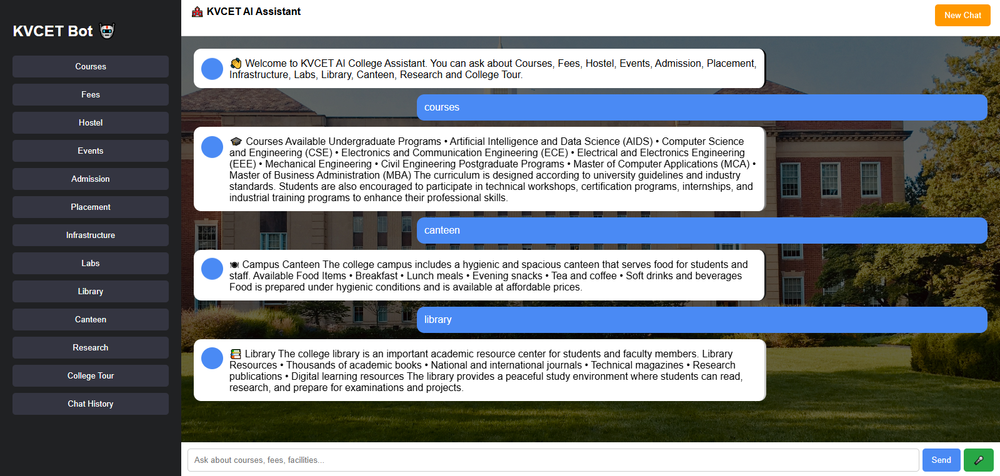

# 🏫 KVCET AI College Assistant

## 🌐 Live Demo
👉 https://saranya-r16.github.io/KCVET-AI-CHATBOT/

## 🔗 GitHub Repository
👉 https://github.com/saranya-R16/KCVET-AI-CHATBOT

---

## 📌 Project Overview
An interactive AI-powered College Assistant Chatbot built using HTML, CSS, and JavaScript.  
This project helps students explore college-related information such as courses, fees, hostel facilities, placements, and more through a smart chat interface.

---

## 🚀 Features
- Interactive Chatbot UI  
- Voice Input (Speech Recognition)  
- Voice Output (Speech Synthesis)  
- Typing Animation & Smooth Scrolling  
- Predefined College Information Responses  
- Chat History Tracking  
- New Chat Reset Option  
- Responsive and Modern UI Design  

---

## 🎯 Modules Covered
- Courses & Programs  
- Fees Structure  
- Hostel Facilities  
- Events  
- Admission Process  
- Placement Details  
- Infrastructure  
- Labs  
- Library  
- Canteen  
- Research  
- Virtual Tour  

---

## 🎨 UI Design & Feel
- Clean and modern interface  
- Smooth animations  
- User-friendly chatbot experience  

---

## 🖼️ Screenshots

### Welcome Screen

### Course Details

### Admission Details

### Chat History

### New Chat Feature

---

## 🛠️ Technologies Used
- HTML5  
- CSS3  
- JavaScript  
- Web Speech API  

---

## ⚙️ How to Run
1. Clone the repository  
2. Open the project folder  
3. Run `index.html` in any browser  
4. Click "Start Chat" to begin  

---

## 📌 Future Enhancements
- Real AI integration  
- Multi-language support  
- Database integration  
- Personalized dashboard  

---

## 👩‍💻 Author
Saranya R

---

## ⭐ Project Purpose
- Academic submission  
- Portfolio project  
- Learning chatbot development  
